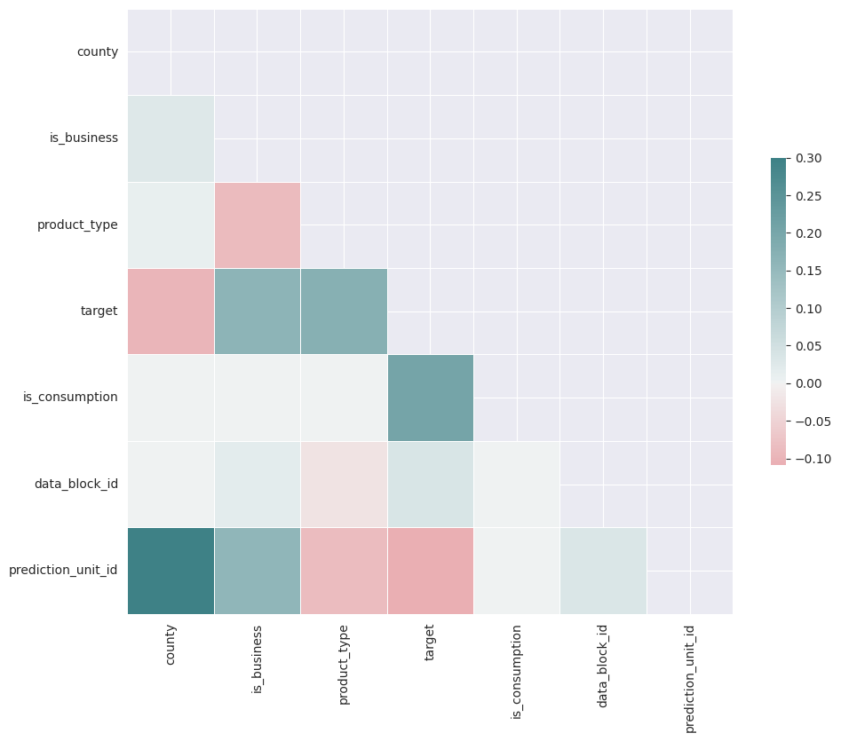
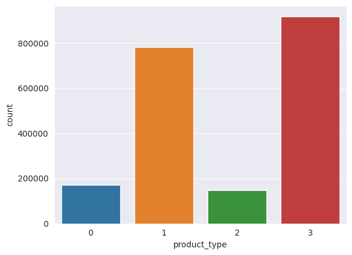
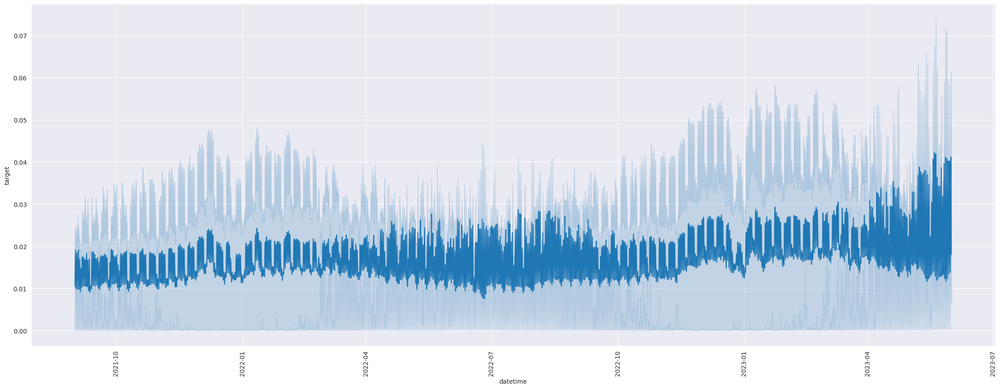
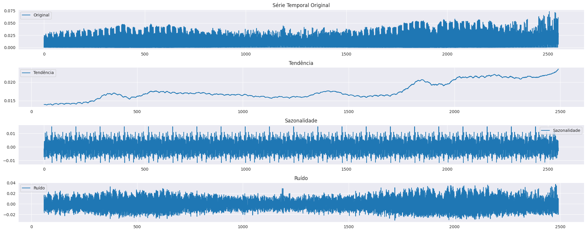

# Energy Prediction Model for Prosumers

## Visão Geral

O objetivo deste projeto é criar um modelo de previsão de energia para prosumidores, a fim de reduzir os custos de desequilíbrio energético. Este trabalho foi desenvolvido com base em um desafio proposto no Kaggle, que visa abordar a questão do desequilíbrio energético, um cenário em que a energia esperada para ser utilizada não corresponde à energia real utilizada ou produzida. Os prosumidores, que consomem e geram energia, contribuem significativamente para esse desequilíbrio, causando problemas logísticos e financeiros para as empresas de energia.

## Descrição

O número de prosumidores está aumentando rapidamente, e resolver os problemas de desequilíbrio energético e seus custos crescentes é vital. Se não for abordado, isso pode levar a custos operacionais mais altos, potencial instabilidade na rede e uso ineficiente dos recursos energéticos. Se este problema for efetivamente resolvido, reduzirá significativamente os custos de desequilíbrio, melhorará a confiabilidade da rede e tornará a integração dos prosumidores no sistema de energia mais eficiente e sustentável. Além disso, pode potencialmente incentivar mais consumidores a se tornarem prosumidores, sabendo que seu comportamento energético pode ser gerenciado adequadamente, promovendo assim a produção e o uso de energia renovável.

## Dados

Os dados utilizados neste projeto foram fornecidos pelo Kaggle e podem ser encontrados [aqui](https://www.kaggle.com/c/energy-prediction-model-for-prosumers/data). Os dados são divididos em 2 arquivos:

- `train.csv`: contém os dados de treinamento, com mais de 2.000.000 linhas e 9 colunas;
- `test.csv`: contém os dados de teste, com 12.480 linhas e 9 colunas;

As colunas presentes nos datasets são:

- `county`: o condado em que o prosumidor está localizada;
- `is_business`: se o prosumidor é comercial ou não;
- `product_type`: código de identificação para mapear diferentes tipos de contratos de energia;
- `target`: consumo ou produção de energia para aquela linha;
- `is_consumption`: se a linha é de consumo ou produção de energia;
- `datetime`: data e hora da medição;
- `data_block_id`: identificador de bloco de dados;
- `prediction_unit_id`: identificador de unidade de previsão;

## Metodologia

O projeto foi desenvolvido utilizando a linguagem Python e a biblioteca Scikit-Learn. O processo de desenvolvimento foi dividido em 3 etapas:

- Análise Exploratória dos Dados;
- Pré-processamento dos Dados;
- Modelagem;

### Análise Exploratória dos Dados

Após a importação de bibliotecas e dos datasets necessários, é iniciada a etapa de EDA, ou, Análise Exploratória dos Dados. A análise exploratória dos dados foi realizada com o objetivo de entender melhor os dados e extrair informações relevantes para o desenvolvimento do modelo. Para isso, foram utilizadas técnicas de visualização de dados, como histogramas, mapas de calor, gráficos de barras e gráficos de dispersão.

Além disso, foi realizada uma análise de correlação entre as variáveis, a fim de identificar quais variáveis possuem maior correlação com a variável alvo, e quais variáveis possuem maior correlação entre si. A partir dessa análise, foi possível identificar que as variáveis `product_type` e `is_business` possuem uma alta correlação entre si, e que a variável `is_consumption` possui uma alta correlação com a variável alvo `target`, que representa o consumo ou produção de energia para aquela linha.

Com a utilização de demais técnicas de visualização de dados, foi possível identificar que as variáveis `is_consumption` e `is_business` possuem equilíbrio entre as classes, e que a variável `product_type` possui um desequilíbrio entre as classes, sendo que a classe 1 e 3 possuem uma quantidade de registros muito maior que as demais classes.

### Pré-processamento dos Dados

Após a etapa de EDA, foi iniciada a etapa de pré-processamento dos dados. Nesta etapa, foram realizadas as seguintes tarefas:

- Remoção de colunas desnecessárias;
  - Para isso, foi utilizada a função `drop` da biblioteca Pandas, para remover as colunas `county`, `data_block_id` e `prediction_unit_id`;
- Remoção de registros com valores nulos;
  - Para isso, foi utilizada a função `dropna` da biblioteca Pandas, para remover os registros com valores nulos;
- Transformação de variáveis categóricas em numéricas;
  - Não foi identificada nenhuma variável categórica;
- Normalização dos dados;
  - Para isso, foi utilizado a função MinMaxScaler da biblioteca Scikit-Learn, para normalizar os dados entre 0 e 1 da variável alvo `target`;
- Agrupamento dos dados por data e hora;
  - Para isso, foi utilizado a função `resample` da biblioteca Pandas, para agrupar os dados por horas, a fim de reduzir a quantidade de registros e facilitar o treinamento do modelo;
  - Foi utilizado o método `mean` para calcular a média dos valores de cada grupo, assim, obtendo um único valor para os grupos de 6, 12 e 24 horas;
  - Por fim, foi observado através de gráficos de linhas o comportamento de cada agrupamento, e foi identificado que o agrupamento de 6 horas possui um comportamento mais próximo do real, e por isso, foi utilizado para o treinamento do modelo;

- Decomposição dos dados em tendência, sazonalidade e resíduo;
  - Para isso, foi utilizado a função `seasonal_decompose` da biblioteca Statsmodels, para decompor os dados em tendência, sazonalidade e resíduo;
  - Por fim, foi observado através de gráficos de linhas o comportamento de cada decomposição, e foi identificado que há uma tendência de crescimento nos dados, e que a sazonalidade possui um comportamento cíclico, com picos de consumo e produção de energia a cada 30 dias;

- Separação dos dados em treino e teste;
  - Após definição de agrupamento e decomposição dos dados, foi realizada a separação dos dados em treino e teste;
  - Para isso, foi utilizado o slice `[:len(train) * 0.8]` para separar 80% dos dados para treino, e o slice `[len(train) * 0.8:]` para separar 20% dos dados para teste;

### Modelagem

Após a etapa de pré-processamento dos dados, foi iniciada a etapa de modelagem. Nesta etapa, foram utilizados os seguintes modelos de regressão:

- Decision Tree Regressor;
- K-Nearest Neighbors Regressor;
- Multi-layer Perceptron Regressor;
- Support Vector Regressor;
- Random Forest Regressor;
- Gradient Boosting Regressor;

> O objetivo do projeto possuía viés acadêmico, e por isso, foi interessante a utilização de diversos modelos de regressão.

Para cada modelo, foi necessário aplicar o método `make_reduction` da biblioteca Sktime, com o objetivo de tornar o modelo capaz de realizar previsões em séries temporais. Além disso, foi necessário passar o parâmetro `window_length=40`, para informar ao modelo que a janela de previsão é de 40 registros, representando o mês de previsão.

## Resultados

Após a etapa de modelagem, foi possível identificar que o modelo que obteve o melhor desempenho foi o `DecisionTreeRegressor`, com um MSE de 141089.1, RMSE de 375.52 e MAE de 300.02. Os modelos foram avaliados utilizando a métrica MSE, RMSE e MAE, e os resultados podem ser encontrados na tabela abaixo:

| model                                             | configuration                                     | mse           | rmse         | mae          |
| ------------------------------------------------- | ------------------------------------------------- | ------------- | ------------ | ------------ |
| DecisionTreeRegressor                             | criterion=squared_error, max_depth=20             | 1.435215e+05  | 3.785749e+02 | 3.023040e+02 |
| DecisionTreeRegressor                             | criterion=absolute_error, max_depth=40            | 1.410891e+05  | 3.755273e+02 | 3.000286e+02 |
| KNeighborsRegressor                               | n_neighbors=5, metric=minkowski                   | 8.738133e+04  | 2.956033e+02 | 2.499135e+02 |
| KNeighborsRegressor                               | n_neighbors=10, metric=precomputed                | 9.064544e+04  | 3.010738e+02 | 2.602469e+02 |
| MLPRegressor                                      | learning_rate=constant, batch_size=100, activa... | 3.067546e+136 | 5.538543e+67 | 5.181336e+66 |
| MLPRegressor                                      | learning_rate=adaptive, batch_size=200, activa... | 9.124009e+04  | 3.020448e+02 | 2.638850e+02 |
| SVR                                               | kernel=linear, C=1.0, gamma=auto                  | 8.627979e+04  | 2.937342e+02 | 2.596869e+02 |
| SVR                                               | kernel=sigmoid, C=2.0, gamma=scale                | 8.160526e+04  | 2.856663e+02 | 2.541999e+02 |
| RandomForestRegressor                             | random_state=42, max_depth=20, criterion=poisson  | 7.902901e+04  | 2.811198e+02 | 2.486435e+02 |
| GradientBoostingRegressor                         | criterion=squared_error, max_depth=20             | 1.073397e+05  | 3.275763e+02 | 2.687456e+02 |

## Conclusão

O modelo `DecisionTreeRegressor` obteve o melhor desempenho, com um MSE de 141089.1, RMSE de 375.52 e MAE de 300.02. Apesar da aplicação de diversos modelos, ainda há espaço para melhorias, como por exemplo, a utilização de técnicas de feature engineering, para criar novas variáveis que possam melhorar o desempenho do modelo. Além disso, é possível utilizar técnicas de feature selection, para identificar quais variáveis possuem maior importância para o modelo, e assim, reduzir a dimensionalidade dos dados.

## Referências

- [Energy Prediction Model for Prosumers](https://www.kaggle.com/c/energy-prediction-model-for-prosumers/data)
- [API Referente - sktime documentation](https://www.sktime.net/en/latest/api_reference.html)
